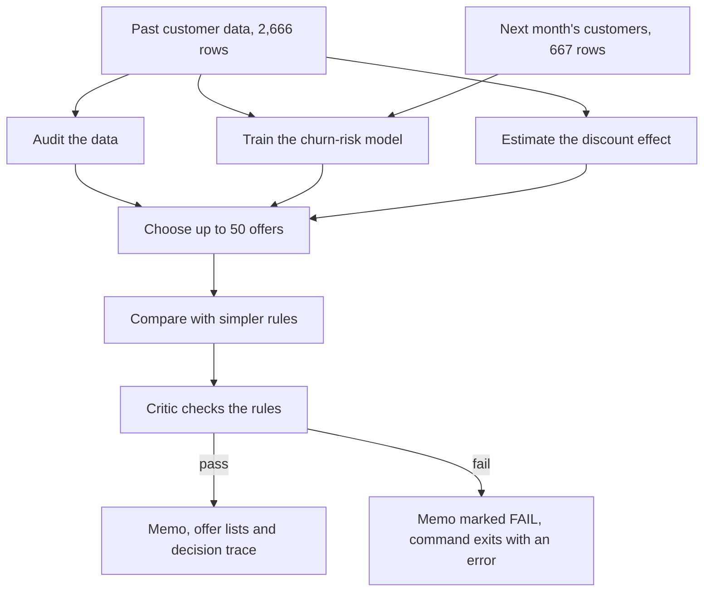

# Retention Uplift: 50 offers, $1,000, maximum net gain

**Which 50 customers should get a $20 retention discount, when the data says nothing sure about whether the discount works?** A governed pipeline that audits the data, calibrates churn risk, bounds the discount's effect honestly, allocates the budget across save-rate scenarios, scores the list on the labelled test set, and refuses to present a recommendation that breaks its own rules.

  

> **In plain English:** A telecom retention team can afford 50 discount offers of $20 each, $1,000 in total. This repository chooses who gets them, skips customers who would stay or leave anyway, and states plainly that past data cannot prove the discount works. It is a tested case-study prototype built on synthetic data, not a live system.
>
> **Reading guide:** business readers can read the next three sections, then jump to [SWOT](#swot-analysis) and [where this applies](#where-this-applies). Engineers can go straight to [The case](#the-case).

## The problem in plain English

Picture a mobile operator's marketing team with $1,000 for next month's retention campaign. Its only tool is a one-off $20 discount, at most one per customer, so no more than 50 people can get it ([the case](#the-case)). Which 50 should they be?

The usual answer is "the customers most likely to leave". The case notes that this wastes money in three ways. Some customers were never going to leave, so the discount buys nothing: these are *sure things*. Others will leave whatever happens, so the discount is thrown away: these are *lost causes*. Others are worth too little to justify the $20. The money only works on *persuadables*, whose decision an offer can change, and it pays off most on the valuable ones. The scikit-uplift guide to [types of customers](https://www.uplift-modeling.com/en/latest/user_guide/introduction/clients.html) describes these groups.

A second question is harder: does the discount change anyone's mind at all? The past data cannot say. Discounts were not handed out at random: 12.7% of customers with neutral feedback got one, against 2% of those with positive feedback. Discounted customers also left more often (20.0% against 14.3%), but the comparison is unfair because the two groups were different to begin with. Statisticians call this *confounding* ([what the data says](#what-the-data-says-and-what-the-pipeline-does-about-it), [data audit](reports/run1/audit.md)).

This project handles both problems in the open. It removes sure things and lost causes using counts from the data, and ranks everyone else by the money at risk. It reports results for a range of *save rates* (the share of reachable leavers an offer keeps), because nobody knows the true one. It also produces a second list that holds 10 customers back at random, so the campaign itself can measure whether the discount works.

## Executive summary

| Question | Answer |
|---|---|
| What problem does this address? | Spending a small retention budget where it can change a customer's decision, when past data cannot show that the offer works. |
| Who has this problem? | Retention, customer-lifecycle and marketing-analytics teams in subscription businesses such as telecoms, broadband, streaming, insurance and software. |
| What does this repository do? | A Python pipeline audits the data, predicts churn (customers leaving), estimates the discount's effect with uncertainty ranges and picks the 50 offers. It then compares the list with simpler rules, and a rule-checking "critic" must pass it before the memo calls it a recommendation. |
| What has been shown so far? | On the 667 labelled test customers, 45 of the 50 chosen customers did leave when no offer was made. The list reaches $46,158 of segment-weighted customer value, against a hindsight ceiling of $48,138. Choosing by churn risk alone reaches $21,533 and spends 28 offers on lost causes ([memo](reports/run1/MEMO.md)). No method finds a reliable discount effect: the confounding-adjusted estimate's 95% interval runs from −0.057 to +0.078 ([uplift.json](reports/run1/uplift.json)). |
| How mature is it? | A tested case-study prototype. It has 8 automated tests, run by continuous integration (CI) on Python 3.10 and 3.12 ([workflow](.github/workflows/ci.yml)), and one committed run ([memo](reports/run1/MEMO.md)). The repository documents no live campaign. |
| What it is not | Not proof that the discount works: every gain figure depends on an assumed save rate. Not a large language model (LLM) agent: the "agentic" stages are deterministic Python functions with contracts and a veto ([details](#the-agentic-part-and-what-it-is-not)). Not tested on real customers: the synthetic data separates leavers almost perfectly. |
| What it would take to use it for real | Real customer data with a trusted customer-value figure; a pilot that uses the hold-back list to measure the save rate; agreed segment weights; a fresh calibration check; a privacy review; and a connection to the system that sends the offers. |

## How it works, end to end



1. **Audit the data** (`retention_uplift/audit.py`). The audit counts how often each feedback segment churned, with and without the discount, and adds Wilson intervals (margins of error that suit small counts). It finds the sure things (none of 1,521 `service_quality/positive` customers left) and the lost causes (every `churn_intent/negative` customer left, including all 15 who got the discount).
2. **Train the churn-risk model** (`churn_model.py`). Gradient-boosted trees with isotonic calibration learn from the 2,531 customers who got no discount, so the output is each customer's chance of leaving *without* an offer. On the test set it scores an AUC of 0.994 (area under the curve, a ranking score where 1.0 is perfect). Its average prediction of 14.4% matches the observed 14.2% ([metrics](reports/run1/churn_metrics.json)).
3. **Estimate the discount effect** (`uplift.py`). Four methods examine the 718 `pricing/neutral` customers, the only group where the discount was tried on people who could go either way. They are a segment comparison, inverse propensity weighting (IPW) with a bootstrap interval, a two-model T-learner and scikit-uplift's class-transformation learner. None finds a reliable effect ([uplift.json](reports/run1/uplift.json)).
4. **Choose the offers** (`policy.py`). Each customer's expected gain is *save rate × segment weight × churn probability × customer value − $20*. The weight is 1 for pricing complaints, 0.5 for support complaints and 0 for sure things and lost causes. Because every offer costs the same, sorting by gain solves this budget (knapsack) problem exactly. The order never depends on the save rate; only the number of offers worth sending does: 40 at 10%, 49 at 20%, 50 from 30% up ([scenarios](reports/run1/scenarios.json)).
5. **Plan the measurement** (`learn_while_earning` in `policy.py`). An alternative list sends 40 offers and holds back 10 of the same 50 customers at random. Comparing the two groups afterwards measures the save rate. At a 30% save rate, that knowledge costs $3,473 of expected gain ([memo](reports/run1/MEMO.md)).
6. **Compare with simpler rules** (`evaluate.py`). Using the test labels, the pipeline scores its list against churn risk alone, customer value alone, risk × value, random picks and a hindsight "oracle".
7. **Check, record and report** (`pipeline.py`). The critic fails a list that overspends, repeats or invents a customer, or targets a sure thing or lost cause. It also fails a list that contains an offer with no positive expected gain, or that rests on a poorly calibrated model. Each stage writes an entry to `decision_trace.jsonl`, and a narrator writes `MEMO.md` from the results. No stage calls a language model.

**Worked example.** Four customers from the committed run ([scored customers](reports/run1/scored_test_customers.csv), [offer list](reports/run1/campaign_offers.csv)):

| Customer | Segment | Churn probability | Customer value | Weight | Rank | Break-even save rate | Result |
|---|---|---:|---:|---:|---:|---:|---|
| CUST_002669 | pricing/neutral | 1.00 | $1,661.22 | 1.0 | 1 | 1.2% | Offer; expected gain $478.37 at a 30% save rate |
| CUST_002723 | churn_intent/negative | 1.00 | $1,607.58 | 0 | 281 | never | No offer: a lost cause |
| CUST_002729 | customer_support/negative | 0.83 | $1,399.68 | 0.5 | 32 | 3.5% | Offer; expected gain $153.41 at a 30% save rate |
| CUST_003092 | pricing/neutral | 0.03 | $1,499.94 | 1.0 | 51 | 40.3% | No offer: ranked 51st, one place outside the budget |

The first two customers look almost the same: both are rated certain to leave, and their values are close. Only the first gets an offer, because in the past data every customer in the second one's segment left, discount or not (15 of 15 with the discount). The last customer is valuable but unlikely to leave, so little money is at risk. In the hold-back list, CUST_002669 happens to be one of the 10 held back ([list with control](reports/run1/campaign_offers_with_control.csv)); that is the price of learning the save rate.

## The case

A telecom's marketing team has $1,000 for next month's retention campaign on `test_new.csv`: single $20 offers, at most one per customer. Historically offers went by churn-risk score alone, which wasted money on customers who would have stayed anyway, customers who left regardless, and low-value customers. **Net Financial Gain** = value retained from customers who would have churned but were saved, minus $20 per targeted customer. Data and dictionary: [rajgupt/telco_churn_case](https://github.com/rajgupt/telco_churn_case) (cloned under `data/`).

## The answer, in one screen

`retention run --out reports/run1` produces [`reports/run1/MEMO.md`](reports/run1/MEMO.md) and [`campaign_offers.csv`](reports/run1/campaign_offers.csv). Summary of that run:

| | |
|---|---|
| Offers | 50 customers, $1,000: 31 pricing/neutral, 13 customer_support/negative, 6 pricing/negative |
| Excluded by evidence | the 379 test customers whose segment never churns, and the 48 whose segment churned 15 of 15 times *with* the discount |
| Churn model | calibrated gradient boosting fit on the 2,531 untreated rows: test AUC 0.994, Brier 0.0039, predicted churn 14.4% vs observed 14.2% (test label used for scoring only) |
| What the discount flag shows | IPW-adjusted churn reduction +0.011 with 95% bootstrap interval [−0.057, +0.078]; out-of-fold Qini −0.03 (T-learner) and +0.03 (class transformation). No demonstrated effect. |
| Reach on the test labels | 45 of the 50 targeted customers did churn without an offer; $46,158 of persuadable-weighted CLV reached, against an oracle ceiling of $48,138 |
| Expected net gain | depends on the unknown save rate *s*: $3.6K at *s* = 0.1, $12.8K at 0.3, $22.1K at 0.5; break-even *s* = 0.02 |
| Baselines the case names | churn-risk top-50 reaches $21.5K and puts 28 offers on lost causes; CLV top-50 $28.6K; risk × CLV top-50 $40.0K; random $3.7K |
| Learn-while-earning list | 40 offers + 10 held out at random from the same 50, so the campaign measures *s*; expected cost $3.5K at *s* = 0.3 |

Every number above is in the run's JSON outputs and regenerates from the command.

## What the data says, and what the pipeline does about it

1. **The discount was not assigned at random** (5% of customers; 12.7% of neutral-sentiment customers, 2% of positive). Churn is *higher* among discounted customers (20.0% vs 14.3%). A naive uplift model concludes the discount hurts; that is confounding.
2. **Two segments are decided before any offer.** `service_quality/positive` customers never churn (1,521 of 1,521). `churn_intent/negative` customers always churn, and the 15 who received the discount all churned anyway. Spending on either is waste by construction, so the policy gives them relevance 0.
3. **Where the discount was actually tried on persuadable people** (pricing complaints), churn was 15.0% without it and 13.2% with it, and every estimator's interval includes zero. The pipeline therefore does not pretend to know the save rate: it reports the decision across *s* and ships a second list with a randomised control so the campaign measures *s* itself.
4. **The ranking does not depend on *s*.** Expected gain is `s × relevance × P(churn) × CLV − 20`, and *s* multiplies every candidate alike; the knapsack with equal costs is solved exactly by sorting. Only the *number* of customers who clear the $20 bar moves with *s* (40 at 0.1, all 50 from 0.3 up).
5. **A scorer can lie by omission.** Counting every reached churner's CLV as saveable makes "risk × CLV" look best ($71K reached) because it spends 22 offers on customers who churn regardless. The memo shows both the consistent and the naive scorer so the assumption is visible rather than buried.

## The agentic part, and what it is not

The pipeline is a bounded sequence of specialist stages with declared outputs, a **decision trace** (`decision_trace.jsonl`, one event per stage with hashes of the input data and the configuration), a **critic** that checks invariants before the list is called a recommendation (budget, one offer per customer, ids exist, no sure things or lost causes, positive expected gain for every offer, calibration on the test set) and records notes the memo must carry, and a **narrator** that writes the memo from the trace. It is deterministic and calls no model API; "agent" here means a stage with a contract and a veto, not a chat loop. The critic's veto is exercised in the tests.

## Run it

```bash
python -m venv .venv && .venv\Scripts\activate      # macOS/Linux: source .venv/bin/activate
pip install -e ".[dev]" scikit-uplift                 # scikit-uplift is used for the Qini metric and one reference learner
pytest -q                                            # 8 tests, about 30 s
retention run --out reports/run1                     # writes MEMO.md, campaign_offers.csv, the control design and all JSON
retention run --out reports/alt --primary 0.2 --support-relevance 1.0   # different assumptions, same machinery
```

## Layout

```
retention_uplift/data.py         loading, encoding, the segment key, budget constants
retention_uplift/audit.py        stage 1: segment table with Wilson bounds; sure things and lost causes from counts
retention_uplift/churn_model.py  stage 2: calibrated churn model on untreated rows; test-set scoring
retention_uplift/uplift.py       stage 3: segment difference, IPW bootstrap, T-learner, class transformation, Qini
retention_uplift/policy.py       stage 4: expected gain, exact knapsack, scenario sweep, learn-while-earning control
retention_uplift/evaluate.py     stage 5: reach on test labels, consistent vs naive NFG, baselines and oracles
retention_uplift/pipeline.py     stages, decision trace, critic, narrator
retention_uplift/cli.py          retention run
research/SOURCES.md              the repositories, datasets and papers consulted, and how they changed the design
reports/run1/                    the committed run
tests/                           audit structure, model scoring, knapsack exactness, bans, control design, critic veto, end to end
```

## Assumptions to challenge

- `estimated_clv` is treated as the value lost on churn, and no discount cost is netted from it.
- Relevance 0.5 for customer-support complaints is a judgement that a price discount half-answers a service complaint. Change it with `--support-relevance`.
- The save rate is unknown. Nothing in the historical data pins it down; the control group is how to learn it.
- The dataset is synthetic and near-deterministic (churn AUC 0.99). Real customers will not separate this cleanly.

## SWOT analysis

A SWOT analysis lists **S**trengths and **W**eaknesses (inside the project) and **O**pportunities and **T**hreats (outside it).

| | Helpful | Harmful |
|---|---|---|
| **Internal** | **Strengths**<br>• States what the data cannot prove, using intervals and save-rate scenarios instead of one invented uplift figure<br>• Excludes sure things and lost causes using counts; the churn-risk-only list puts 28 of 50 offers on lost causes ([memo](reports/run1/MEMO.md))<br>• Exact, explainable selection whose order does not depend on the unknown save rate<br>• Built-in governance: a critic veto covered by tests, a decision trace with data hashes, and a memo written from the results<br>• One command reproduces the run, and 8 tests run in CI | **Weaknesses**<br>• Synthetic, near-deterministic data (test AUC 0.994); real customers will not separate this cleanly<br>• Every gain figure rests on an assumed save rate, because the past discount data shows no reliable effect<br>• Only 135 past discounts, and they were not assigned at random ([data audit](reports/run1/audit.md))<br>• Segment weights, such as 0.5 for support complaints, are judgement calls<br>• Customer value is taken as given, and the $20 is not netted out of it<br>• One offer type and one dataset; no live campaign is documented |
| **External** | **Opportunities**<br>• Run the hold-back list as a pilot to measure the real save rate<br>• Validate on public randomised churn data, such as the Orange Belgium benchmark in [further reading](#further-reading)<br>• Extend to several offers with different costs (a multiple-choice knapsack)<br>• Reuse the critic-and-trace pattern for other automated decisions that need an audit trail | **Threats**<br>• Real data rarely has clean segment labels such as a stated intent to leave<br>• Offers handed out by rule in the past can mislead any model trained on them<br>• Open-source uplift libraries and marketing platforms already cover parts of this workflow<br>• Data-protection rules can limit which customer data may drive individual offers<br>• Customers who learn that complaints bring discounts may change how they behave |

**In short:** the method is careful and open about what it does not know, but its business value stays unproven until a live pilot measures the save rate.

## Where this applies

The pattern fits any business that funds retention offers from a fixed budget and can hold back a random control group. The rows below are typical settings, not documented deployments.

| Industry | Example use case | What this project's approach contributes |
|---|---|---|
| Telecoms and broadband | Monthly retention offers for customers likely to switch provider | Drops sure things and lost causes, then ranks by value at risk within a fixed budget |
| Streaming and digital subscriptions | Discount or pause offers for likely cancellers | A table showing how many offers pay off at each assumed save rate |
| Banking and cards | Fee waivers for customers likely to close an account | A confounding check before trusting the results of past waivers |
| Insurance | Renewal discounts for policyholders likely to switch | A per-customer break-even save rate that makes each discount decision explicit |
| Software as a service (SaaS) | Renewal incentives for accounts at risk of cancelling | Critic rules and a decision trace that finance or audit teams can review |
| Energy retail | Retention credits for customers comparing suppliers | A random hold-back group that measures whether the credits work |
| Retail loyalty programmes | Coupons for lapsing members under a fixed coupon budget | The same ranking and hold-back pattern, applied to coupons |
| Online education | Renewal discounts for learners likely to let a subscription lapse | Segment weights that separate price complaints from service complaints |

## Glossary

| Term | Plain-English meaning |
|---|---|
| Churn | A customer leaving, for example by cancelling a contract. |
| Customer lifetime value (CLV) | The revenue a customer is expected to bring before leaving; here, monthly revenue times estimated remaining months. |
| Net Financial Gain (NFG) | Value kept from customers the offer saved, minus $20 for every customer who got an offer. |
| Uplift (T-learner, class transformation) | The change in behaviour caused by an action such as an offer; the T-learner and class transformation are two standard ways to estimate it. |
| Persuadables, sure things, lost causes | Customers an offer can win over, customers who stay anyway, and customers who leave anyway. |
| Save rate (*s*) | The share of reachable would-be leavers that an offer keeps; it is unknown here, so results are shown for several values. |
| Confounding | When the way a treatment was handed out, rather than the treatment itself, explains a difference in outcomes. |
| Inverse propensity weighting (IPW) | Re-weighting customers by their estimated chance of having received the discount, to correct for how it was handed out. |
| Wilson and bootstrap intervals | Two ways to put a range of plausible values around an estimate: Wilson suits small counts, and the bootstrap re-runs the estimate on resampled data. |
| Calibration | Whether predicted probabilities match what happens; here the model predicted 14.4% churn and 14.2% occurred. |
| AUC and Brier score | Model quality measures: AUC shows how well leavers are ranked above stayers (1.0 is perfect), and Brier is the average squared error of the probabilities (lower is better). |
| Qini coefficient | A score for how well a ranking finds customers who respond to an offer, where zero means no better than random. |
| Knapsack problem | Choosing the most valuable set of items that fits within a fixed budget. |
| Critic and decision trace | The stage that checks the offer list against fixed rules and can veto it, and the log that records what every stage did. |

## Further reading

The first five rows cover the basic methods; the arXiv papers go further into randomised benchmarks and budget-constrained targeting.

| Resource | What it is | Why it matters here |
|---|---|---|
| [scikit-uplift documentation](https://www.uplift-modeling.com/en/latest/) — Maksim Shevchenko and contributors (version 0.5.1) | A Python library for uplift models and metrics; its [types of customers](https://www.uplift-modeling.com/en/latest/user_guide/introduction/clients.html) page explains persuadables, sure things and lost causes. | The pipeline uses it for the Qini coefficient and the class-transformation learner. |
| [Causal Inference and Uplift Modelling: A Review of the Literature](https://proceedings.mlr.press/v67/gutierrez17a.html) — Pierre Gutierrez and Jean-Yves Gérardy, 2017 (PMLR volume 67) | A review comparing the two-model, class-transformation and direct approaches to uplift modelling. | Background for the two learners this project uses as cross-checks. |
| [Real-World Uplift Modelling with Significance-Based Uplift Trees](https://stochasticsolutions.com/pdf/sig-based-up-trees.pdf) — Nicholas J. Radcliffe and Patrick D. Surry, 2011 (PDF) | A practitioner paper on uplift modelling for customer retention and demand stimulation. | Explains why incremental effects need a control group, and describes the Qini measures. |
| [An Introduction to Propensity Score Methods for Reducing the Effects of Confounding in Observational Studies](https://pmc.ncbi.nlm.nih.gov/articles/PMC3144483/) — Peter C. Austin, 2011 (Multivariate Behavioral Research) | A tutorial on propensity scores, including inverse probability of treatment weighting. | Background for the IPW estimate that corrects for how past discounts were assigned. |
| [Binomial proportion confidence interval](https://en.wikipedia.org/wiki/Binomial_proportion_confidence_interval#Wilson_score_interval), section "Wilson score interval" — Wikipedia | An explainer of confidence intervals for percentages, including the Wilson formula. | The audit uses Wilson intervals because some segments have only 15 or 29 discounted customers ([data audit](reports/run1/audit.md)). |
| [A Large Scale Benchmark for Individual Treatment Effect Prediction and Uplift Modeling](https://arxiv.org/abs/2111.10106) — Eustache Diemert et al., 2021 | A very large public dataset from randomised controlled trials, with a set-up for comparing uplift methods. | Shows the kind of randomised evidence that this case's historical data lacks. |
| [A churn prediction dataset from the telecom sector: a new benchmark for uplift modeling](https://arxiv.org/abs/2312.07206) — Théo Verhelst, Denis Mercier, Jeevan Shrestha and Gianluca Bontempi, 2023 | A public churn dataset from a randomised Orange Belgium campaign, in which a random control group was held back from high-risk customers. | It mirrors this project's hold-back design and is a natural real-data test for the pipeline. |
| [End-to-End Cost-Effective Incentive Recommendation under Budget Constraint with Uplift Modeling](https://arxiv.org/abs/2408.11623) — Zexu Sun et al., 2024 (RecSys 2024) | A method that picks an incentive for each customer under a budget, framed as a multi-choice knapsack problem. | It tackles the multi-offer version of this problem; with one offer at one price, as here, sorting solves it exactly. |
| [Guardrailed Uplift Targeting: A Causal Optimization Playbook for Marketing Strategy](https://arxiv.org/abs/2512.19805) — Deepit Sapru, 2025 | A framework that estimates uplift, then allocates offers under budget and other business constraints. | The same estimate-then-allocate structure as this project's policy stage. |
| [Methodology](https://causalml.readthedocs.io/en/latest/methodology.html) — CausalML documentation, Uber Technologies | Documentation for an open-source library of uplift and causal-inference methods, including the T-learner. | A fuller toolkit to try once randomised data is available. |

## License

MIT for the code. The dataset belongs to its repository's author.
